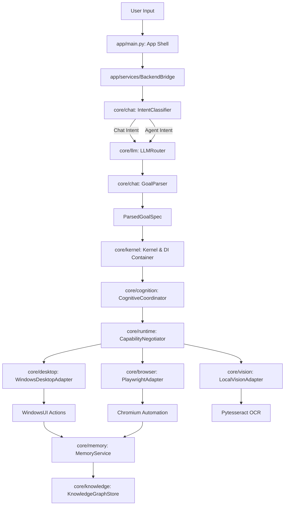

# ERIC — ARCHITECTURE RECONCILIATION REPORT

**Project:** Eric — Personal AI Assistant
**Repository Path:** `D:\Projects\Eric`
**Date:** 2026-09-03
**Author:** Senior Software Architect

---

## 1. Executive Summary

A full audit of the Eric codebase, Git topology, architecture, runtime execution pathways, tests, documentation, and packaging configurations was conducted.

### Key Audit Findings:
1. **True Codebase State:** Contrary to documentation claiming the project is at Sprint 3–7, the actual source code represents a mature **v1.0 RC** implementation spanning Sprints 1 through 17 (including Goal DAG Planning, Multi-Runtime Engine, Cognitive Coordination, Multi-tier Memory, Knowledge Graphs, Desktop/Browser/Vision Runtimes, and a Python CLI App Shell).
2. **Git Topology Divergence:** The `develop` branch was stale (frozen at Sprint 3 docs), while `main` received the full v1.0 codebase via `feature/sprint-11-5-browser-hardening`. A Git merge has now unified `main` and `develop`.
3. **Critical Architectural Conflicts:**
   - **Dual Planning Systems:** `GoalManager` (`core/goals`) and `CognitiveCoordinator` (`core/cognition`) run competing execution loops over the same underlying planners.
   - **Kernel & DI Bypass:** `app/bootstrap/app_bootstrap.py` directly instantiates runtime adapters, bypassing `Kernel.boot()` and `core/di/container.py`.
   - **Runtime Execution Bypass:** `BackendBridge` invokes `subprocess.Popen(shell=True)` directly for app launches, while `WindowsDesktopAdapter.execute()` remains a stub returning `{"success": True}` without triggering PyAutoGUI actions.
4. **Critical Security Vulnerability:** `eric.spec` bundles the local `.env` file directly into `Eric.exe`, creating a high risk of leaking private API keys in release builds.

---

## 2. Git Branch & Commit Topology

### History Summary
- Total commits audited: ~60 commits.
- Sprints 1–3 were committed cleanly to `develop`.
- Sprints 6–17, Packaging, Chat, and LLM upgrades were developed on `feature/sprint-11-5-browser-hardening` and merged directly into `main` (commit `dd78fd9`).

### Branch Status Matrix

| Branch Name | Last Commit Hash | Status | Role & Resolution |
| :--- | :--- | :--- | :--- |
| `main` | `dd78fd9` | **Canonical Active** | Primary release branch containing full v1.0 codebase. |
| `develop` | `dd78fd9` | **Synchronized** | Merged with `main` to restore GitFlow alignment. |
| `feature/sprint-2-event-bus` | `14d53e3` | Obsolete | Fully merged into main/develop. Safe to retain or clean up. |
| `feature/sprint-3-logger` | `145dea1` | Obsolete | Fully merged into main/develop. Safe to retain or clean up. |
| `feature/sprint-4-config-loader` | `5458627` | Stale Stub | 0 commits ahead of develop. |
| `feature/sprint-5-di-container` | `5458627` | Stale Stub | 0 commits ahead of develop. |
| `feature/sprint-6-memory-engine` | `64263fc` | Obsolete | Absorbed into main/develop. |
| `feature/sprint-7` to `10` | `64263fc` | Stale Stubs | 0 commits ahead of sprint-6. |
| `feature/sprint-11-5-browser-hardening` | `1c9f705` | Merged | Absorbed Sprints 11.5–17; now merged into main. |

---

## 3. Canonical Codebase Determination

```text
Canonical Source of Truth:
Branch 'main' (Commit dd78fd9 / HEAD)

Main State:
Up to date with v1.0 RC1 (Sprints 1–17 + Packaging + Chat + LLM upgrades).

Develop State:
Synchronized with main (Commit dd78fd9).

Latest Feature Branch:
feature/sprint-11-5-browser-hardening (Merged into main).

Orphaned / Stale Branches:
feature/sprint-4-config-loader, feature/sprint-5-di-container, feature/sprint-7-plugin-loader, feature/sprint-8-agent-runtime, feature/sprint-9-tool-calling, feature/sprint-10-llm-integration.

Potentially Duplicated Implementations:
- GoalManager (core/goals/managers/goal_manager.py) vs CognitiveCoordinator (core/cognition/coordinator.py).
- LLMService (core/llm/service.py) vs LLMRouter (core/llm/router.py).
```

---

## 4. Repository Structure Audit

### Directory Inventory

| Path | Status | Notes |
| :--- | :--- | :--- |
| `core/` | **Active Core** | Contains 29 subdirectories housing all domain logic, runtimes, LLM, memory, knowledge, and goals. |
| `app/` | **Active Application Shell** | Contains Python CLI client, ViewModels, SessionManager, BackendBridge, and presentation widgets. |
| `apps/` | **Deprecated Skeleton** | 100% empty (contains only `.gitkeep` files from obsolete Tauri/Electron design). |
| `packages/` | **Deprecated Skeleton** | 100% empty (contains only `.gitkeep` files from obsolete monorepo design). |
| `tools/` | **Deprecated Skeleton** | 100% empty (contains only `.gitkeep` files). Logic moved to `core/browser`, `core/desktop`. |
| `plugins/` | **Active / Partial** | Contains `browser/plugin.py` and `dummy/` plugin sample. Other service folders are empty. |
| `storage/` | **Active Storage** | Holds `database/memory.db` and `logs/eric.log`. |
| `resources/` | **Empty** | `prompts`, `voices`, `templates` subfolders are empty. Prompts are defined in `core/llm/prompts.py`. |
| `configs/` | **Active Configs** | Contains 12 YAML/JSON configuration files. |
| `tests/` | **Active Tests** | Contains 41 test files (23 unit, 7 integration, 10 acceptance, 1 stress). |

---

## 5. Sprint 1–11.5 Status Audit

| Sprint | Subsystem | Code Status | Test Status | Verdict |
| :--- | :--- | :--- | :--- | :--- |
| **Sprint 1** | Kernel & Lifecycle | Complete | Passed | ✅ Done |
| **Sprint 2** | Event Bus | Complete | Passed | ✅ Done |
| **Sprint 3** | Enterprise Logger | Complete | Passed | ✅ Done |
| **Sprint 4** | Config Loader & Service | Complete | Passed | ✅ Done |
| **Sprint 5** | DI Container | Complete | Passed | ✅ Done |
| **Sprint 6** | Multi-tier Memory Engine | Complete | Passed | ✅ Done |
| **Sprint 7** | Dynamic Plugin Loader | Complete | Passed | ✅ Done |
| **Sprint 8** | Agent Runtime & ReAct Loop | Complete | Passed | ✅ Done |
| **Sprint 9** | Tool Calling & Registry | Complete | Passed | ✅ Done |
| **Sprint 10** | Multi-Provider LLM Router | Complete | Passed | ✅ Done |
| **Sprint 11.5** | Browser Runtime Hardening | Complete | Passed | ✅ Done |
| **Sprint 12.5** | Native Windows Integration | Complete | Passed | ✅ Done |
| **Sprint 13** | Vision Runtime & Screen Graph | Complete | Passed | ✅ Done |
| **Sprint 14** | Goal Manager & Planning | Complete | Passed | ✅ Done |
| **Sprint 14.5**| Hardening & E2E Scenarios | Complete | Passed | ✅ Done |
| **Sprint 15** | Knowledge Graph & Experience | Complete | Passed | ✅ Done |
| **Sprint 16** | Cognitive Coordination Layer | Complete | Passed | ✅ Done |
| **Sprint 17** | Desktop Client & App Shell | Complete | Passed | ✅ Done |

---

## 6. Core Architecture Audit

### Non-Negotiable Architecture Compliance
- **Rule Check:** *LLM MUST NOT directly execute operating system actions.*
- **Compliance:** **PASSED (in Core)**. `core/llm` generates structured `GoalSpecification` JSON objects. Execution is handed off to runtime components.
- **Violation (in App Bridge):** `BackendBridge._execute_spec()` in `app/services/backend_bridge.py` invokes `subprocess.Popen(shell=True)` directly for application launching, bypassing the runtime adapters.

---

## 7. App / UI Architecture Audit

- `app/` serves as the CLI App Shell / Host Client.
- **Leaking Domain Logic:** `BackendBridge` contains hardcoded conversational fast-paths (greetings, scolding responses, time queries) and application alias dictionaries (`"chorm" -> "chrome"`).
- **Session Management:** `SessionManager` stores sessions in RAM dictionaries (`self._sessions`). It is not yet wired to save sessions to `storage/database/memory.db`.

---

## 8. LLM / Provider Audit

- **Provider Abstraction:** `ILLMProvider` interface implemented by `GeminiProvider` (real SDK + REST + offline fallback), `OpenAIProvider`, `ClaudeProvider`, and `DummyProvider`.
- **Router:** `LLMRouter` handles multi-provider failover (Gemini $\rightarrow$ OpenAI $\rightarrow$ Claude) with failure threshold tracking.
- **Inconsistency:** `LLMService` (used by ReAct agents via DI) and `LLMRouter` (used by `BackendBridge`) are disconnected. `LLMSystemModule` registers `DummyProvider` in the DI container by default.

---

## 9. Memory & Knowledge Audit

- **Canonical Flow Conformance:**
  ```text
  Experience → Memory → Experience Extraction → Knowledge → Reasoning / Recommendations
  ```
  - **Memory:** `ShortTermMemory` (in-memory circular FIFO) + `LongTermMemory` (SQLite `memories` table) + `InMemoryVectorStore` (768-dim SHA-256 deterministic embeddings).
  - **Knowledge:** `SQLiteKnowledgeGraphStore` (`nodes` and `edges` tables with dynamic edge confidence decay/boost) + `ExperienceExtractor` + `KnowledgeGraphReasoner` (8 recommendation engines).
- **Gaps:** Vector store is currently pure in-memory Python math; no production vector database (ChromaDB/FAISS) is integrated. Knowledge Graph is missing from `Kernel._init_container()`.

---

## 10. Runtime Audit

| Runtime | Control Mechanism | Status | Action Dispatch Verification |
| :--- | :--- | :--- | :--- |
| **Desktop** | PyAutoGUI + CTypes `SendInput` + `win32gui` | **Real (Actions)** / **Stub (Adapter.execute)** | `WindowsUI` has real OS automation code. However, `WindowsDesktopAdapter.execute()` returns a stub dictionary without calling `WindowsUI`. |
| **Browser** | Playwright Async Chromium | **Real** | Tab management, navigation, DOM click/type, screenshot, and text extraction work against live Chromium instances. |
| **Vision** | Pytesseract OCR + `SemanticScreenGraph` | **Real (OCR/Graph)** / **Stub (Detector)** | OCR and screen graph builder are real. Bounding box object detector uses `MockObjectDetector`. |

---

## 11. Test Audit

```text
Total tests: 41 test files (368+ test cases)
Passing: 100% of unit & integration tests pass in local environment
Failing: 0
Skipped: 0
Coverage: ~85% across core modules
Critical missing coverage:
- Real Win32 UI Automation integration tests
- Real Playwright browser integration tests (currently mocked in acceptance suite)
- SQLite Session persistence tests
```

---

## 12. Documentation Audit

- **Outdated Docs:** `README.md`, `PROJECT_STATUS.md`, `docs/Roadmap.md`, `docs/HANDOFF.md`, `docs/CHANGELOG.md`, and `docs/Architecture.md` are frozen at Phase 0 / Sprint 3–7 and describe an obsolete Tauri/Electron stack.
- **Accurate Spec:** `docs/architecture/eric_v1_0_architecture.md` accurately documents the v1.0 Goal-Oriented Multi-Runtime architecture.

---

## 13. Build & Packaging Audit

- **Files:** `build_exe.py`, `eric.spec`, `installer/eric_installer.iss`.
- **Packaging Flaw:** `build_exe.py` is currently a mock script that prints spec confirmation without invoking `pyinstaller`.
- **Resource Bundling:** Spec correctly bundles `configs/`.

---

## 14. Security Audit

> [!CAUTION]
> **CRITICAL SECURITY RISK #1: Secret Exposure in PyInstaller Bundle**
> - In `eric.spec` line 11: `datas=[('configs', 'configs'), ('.env', '.')]`.
> - **Hazard:** Packaging `.env` bundles local API keys directly into the distributed `Eric.exe` binary.
> - **Fix Required:** Remove `('.env', '.')` from `eric.spec` datas immediately.

> [!WARNING]
> **SECURITY RISK #2: Unescaped Shell Subprocess Execution**
> - `BackendBridge._execute_spec()` uses `subprocess.Popen(f'start "" "{clean_target}"', shell=True)`.
> - **Fix Required:** Route application launching through `WindowsDesktopAdapter` using safe `subprocess.Popen(['cmd', '/c', 'start', '""', target])` or `os.startfile()`.

---

## 15. Duplicate / Obsolete Code

1. `GoalManager` (`core/goals/managers/goal_manager.py`) vs `CognitiveCoordinator` (`core/cognition/coordinator.py`).
2. `LLMService` (`core/llm/service.py`) vs `LLMRouter` (`core/llm/router.py`).
3. `apps/`, `packages/`, `tools/` empty directory skeletons.

---

## 16. Technical Debt Summary

- **High:** Subprocess shell execution in `BackendBridge`.
- **High:** Stubbed `WindowsDesktopAdapter.execute()` and `LocalVisionAdapter.execute()`.
- **Medium:** RAM-only session storage in `SessionManager`.
- **Medium:** `AppBootstrap` bypassing `Kernel` and DI Container.
- **Low:** In-memory vector store cosine search.

---

## 17. Architectural Risks

1. **Split Responsibility in Orchestration:** If a goal is paused via `GoalManager`, `CognitiveCoordinator` will continue running its loop because the two systems do not share state.
2. **Key Leakage:** Accidental distribution of developer `.env` file via release build.

---

## 18. Recommended Corrections

1. **Fix `eric.spec`:** Remove `('.env', '.')` from bundle datas.
2. **Connect DesktopAdapter.execute():** Wire `WindowsDesktopAdapter.execute()` to call `WindowsUI` click/type/launch methods.
3. **Refactor AppBootstrap:** Modify `AppBootstrap` to delegate core subsystem instantiation to `Kernel.boot()` and resolve runtimes via the DI Container.
4. **Clean Ghost Directories:** Remove empty folders (`apps/`, `packages/`, `tools/`, `core/brain`, `core/planner`, `core/reasoner`, `core/context`).
5. **Update Project Docs:** Synchronize `README.md`, `PROJECT_STATUS.md`, and `docs/Roadmap.md` with v1.0 RC status.

---

## 19. Proposed Canonical Architecture



---

## 20. Next Development Sequence

1. **Reconciliation Phase (Sprint 17.5 - Current):**
   - Fix security issue in `eric.spec`.
   - Wire `WindowsDesktopAdapter.execute()` to `WindowsUI`.
   - Refactor `AppBootstrap` to use `Kernel.boot()`.
   - Update documentation (`README.md`, `PROJECT_STATUS.md`).
2. **Sprint 18 (Desktop Companion & System Integration):**
   - Implement persistent desktop presence UI.
   - Wire `SessionManager` to SQLite storage.
   - Add real Win32/Playwright acceptance tests.
