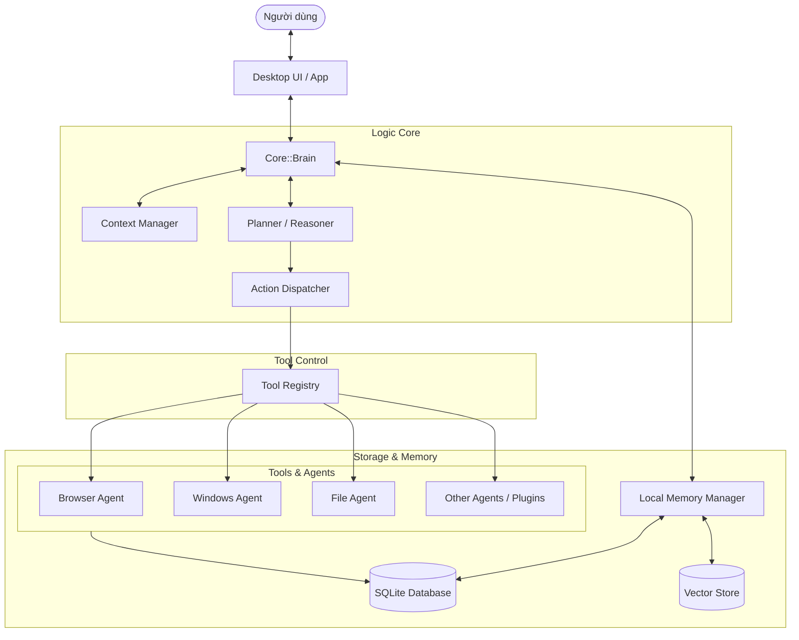
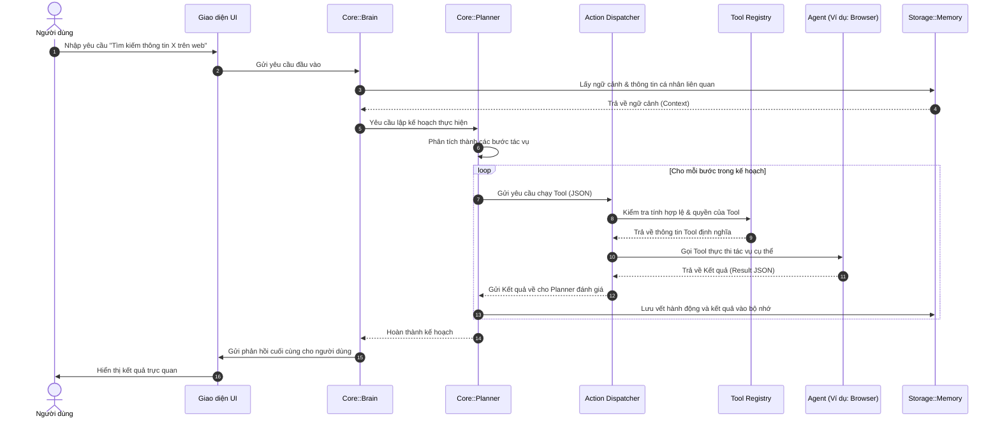

# Đặc tả Kiến trúc Hệ thống Eric

Tài liệu này cung cấp cái nhìn chi tiết về thiết kế kiến trúc cốt lõi của **Eric**, giải thích vai trò của từng thành phần và cách thức chúng giao tiếp với nhau theo nguyên tắc cách ly (decoupling).

---

## 1. Sơ đồ Kiến trúc Tổng quan (High-Level Architecture)



---

## 2. Các Thành phần Cốt lõi (Core Components)

### 2.1. Core::Brain (Bộ não)
Brain chịu trách nhiệm nhận yêu cầu đầu vào từ giao diện người dùng, khôi phục ngữ cảnh (Context) từ bộ nhớ và đưa ra quyết định hành động tiếp theo.
* **Brain không giữ trạng thái thực thi trực tiếp**, nó dựa hoàn toàn vào Context Manager và Memory để suy luận.
* **Brain không biết cách điều khiển chuột, bàn phím hay truy cập file**, nó chỉ biết cách "suy nghĩ" và tạo ra các kế hoạch hành động trừu tượng.

### 2.2. Planner & Reasoner (Bộ Lập Kế Hoạch & Suy Luận)
* **Planner**: Chia nhỏ một yêu cầu phức tạp của người dùng thành một danh sách các bước thực thi tuần tự hoặc song song (Task Breakdown).
* **Reasoner**: Suy luận sâu (Deep Reasoning) cho các bài toán logic phức tạp, đánh giá kết quả trả về từ Agent để quyết định xem bước tiếp theo có cần thay đổi kế hoạch hay không (Reflection / Self-Correction).

### 2.3. Action Dispatcher (Bộ Điều phối Hành động)
Đây là cổng kết nối duy nhất giữa Core và các Agent bên ngoài.
* Nhận lệnh thực thi từ Planner (ví dụ: `exec_tool("click_element", {selector: "#submit"})`).
* Tìm kiếm công cụ tương ứng trong **Tool Registry**.
* Gửi lệnh tới Agent đích và đợi kết quả trả về dưới dạng JSON chuẩn hóa.

### 2.4. Tool Registry (Đăng ký Công cụ)
Nơi quản lý thông tin đăng ký (Schema) của tất cả các công cụ mà Eric có thể sử dụng. Các Agent khi khởi động sẽ tự động đăng ký các công cụ của mình vào đây qua giao thức MCP.

### 2.5. Agents (Các tác nhân thực thi)
Mỗi Agent là một mô-đun chạy độc lập hoặc một thư viện cách ly hoàn toàn:
* **Browser Agent**: Chuyên trách quản lý trình duyệt (Playwright/Chrome DevTools Protocol). Được chia nhỏ thành các mô-đun con để quản lý tab, DOM, tải lên/tải xuống, xử lý cookie.
* **Windows Agent**: Điều khiển hệ điều hành (Keyboard/Mouse simulation, OCR, Window management).
* **File Agent**: Quản lý tệp tin một cách an toàn trong các thư mục được cấp quyền.

---

## 3. Quy tắc Kiến trúc "Đóng đinh" (Architectural Constraints)

Để giữ cho Eric bền vững qua nhiều năm phát triển, hệ thống phải tuân thủ nghiêm ngặt các quy tắc sau:

1. **Nguyên tắc Phân tách Tuyệt đối (Decoupling Rule)**:
   * **Cấm tuyệt đối** việc import thư viện hoặc gọi trực tiếp code của Agent từ trong Brain hoặc Planner. 
   * Brain chỉ giao tiếp với Agent thông qua chuỗi lệnh JSON được gửi qua `Action Dispatcher`.
2. **Nguyên tắc Local-First**:
   * Tất cả dữ liệu cá nhân, logs và vector nhúng đều được ghi trực tiếp vào thư mục `storage/` trên máy local.
   * LLM API có thể dùng cloud (Gemini/OpenAI) nhưng dữ liệu nhạy cảm phải được lọc hoặc ẩn danh trước khi gửi đi.
3. **Mô-đun hóa Browser Agent**:
   * Không gộp chung toàn bộ tính năng duyệt web vào một file duy nhất. Phải chia nhỏ thành các thành phần: `dom/` (phân tích cấu trúc), `cdp/` (kết nối trực tiếp chrome), `tabs/` (quản lý trạng thái tab), v.v.

---

## 4. Luồng dữ liệu Chi tiết (Sequence Flow)

Dưới đây là sơ đồ tuần tự thể hiện cách một tác vụ được xử lý từ đầu đến cuối:



---

## 5. Thiết kế Bộ nhớ & Phân cấp (Memory Layout & Tiers)

Để đảm bảo hiệu năng và ngữ cảnh thông tin chính xác, bộ nhớ của Eric được chia thành 5 lớp phân cấp rõ ràng:

1. **Working Memory (Bộ nhớ làm việc)**: Lưu trữ các biến tạm thời, dữ liệu runtime của phiên làm việc hiện tại (RAM).
2. **Short-term Memory (Bộ nhớ ngắn hạn / Episodic)**: Lưu trữ lịch sử hội thoại gần nhất và chuỗi hành động vừa diễn ra (SQLite).
3. **Long-term Memory (Bộ nhớ dài hạn / Semantic)**: Lưu trữ các thông tin đã được đúc kết, user profile, thói quen và sự kiện lịch sử (SQLite).
4. **Knowledge Base (Cơ sở tri thức)**: Lưu các tài liệu tĩnh, dữ liệu nghiệp vụ của người dùng (Tệp tin cục bộ, Markdown).
5. **Vector Memory (Bộ nhớ vector ngữ nghĩa)**: Các đoạn mã hóa vector nhúng (embeddings) phục vụ tìm kiếm tương đồng (ChromaDB).

* **Consolidation Pipeline**: Một tác vụ chạy nền định kỳ quét qua Short-term Memory, sử dụng LLM để trích xuất tri thức mới ghi vào Long-term/Vector Memory và dọn dẹp các thông tin rác.

---

## 6. Đóng băng Công nghệ Sử dụng (Frozen Tech Stack)

| Thành phần | Công nghệ lựa chọn | Ghi chú |
| :--- | :--- | :--- |
| **Desktop UI** | React + Tauri (TS) | Đảm bảo giao diện mượt mà và nhẹ |
| **Core AI / Brain** | Python | Hỗ trợ hệ sinh thái ML/AI mạnh mẽ |
| **IPC (Communication)** | Local Socket / Message Bus nội bộ | Giao tiếp bất đồng bộ giữa Tauri và Python Core |
| **Database** | SQLite | Cơ sở dữ liệu quan hệ cục bộ gọn nhẹ |
| **Vector DB** | ChromaDB | Lưu trữ vector nhúng cục bộ |
| **Automation** | Playwright + Win32 API | Điều khiển trình duyệt và tương tác Windows |
| **Voice STT** | Faster-Whisper | Nhận diện giọng nói tiếng Việt/Anh cục bộ tốt |
| **Voice TTS** | Piper | Tổng hợp giọng nói cục bộ hiệu năng cao |
| **Configuration** | YAML | Dễ đọc, dễ cấu hình |
| **Logging** | Loguru / structlog | Ghi log có cấu trúc và hiệu năng cao |
| **Dependency Injection**| Custom DI Container hoặc Python Dependency Injector | Đảm bảo kiến trúc lỏng giữa các Service |

---

## 7. Quy ước Sự kiện (Event Naming Conventions)

Mọi sự kiện trên Event Bus bắt buộc tuân theo định dạng: `[namespace].[component].[action]`. 

### Danh sách các sự kiện nền tảng:
* `system.start` / `system.ready` / `system.shutdown` - Vòng đời ứng dụng.
* `ui.message.received` - UI nhận tin nhắn mới từ người dùng.
* `brain.plan.created` - Brain tạo thành công kế hoạch hành động.
* `planner.task.created` / `planner.task.completed` - Trạng thái thực thi tác vụ con.
* `agent.[name].started` / `agent.[name].finished` - Vòng đời chạy của một Agent cụ thể (ví dụ: `agent.browser.started`).
* `memory.saved` / `memory.loaded` - Đọc/ghi bộ nhớ.
* `plugin.loaded` / `plugin.unloaded` - Quản lý plugin động.
* `error.occurred` - Báo lỗi hệ thống chung.

---

## 8. Chuẩn hóa Vòng đời Agent (Agent Lifecycle)

Mỗi Agent hoạt động trong thư mục `tools/` phải triển khai một interface vòng đời thống nhất nhằm tương thích với DI và Event Bus:

```text
Initialize (Khởi tạo biến)
      ↓
Load Config (Nạp cấu hình chi tiết)
      ↓
Register (Đăng ký Tool Schema lên Registry)
      ↓
Ready (Trạng thái sẵn sàng lắng nghe)
      ↓
Running (Đang thực thi nhiệm vụ)
      ↓
Paused (Tạm dừng thực thi)
      ↓
Stopped (Giải phóng tài nguyên và dừng hẳn)
```

---

## 9. Định dạng Đầu ra Chuẩn của Tool (Tool Output Format)

Mọi tool thực thi bởi Agent bắt buộc phải trả về dữ liệu có cấu trúc JSON thống nhất sau để Action Dispatcher và Planner có thể phân tích dễ dàng:

```json
{
  "success": true,
  "data": {},
  "error": null,
  "execution_time": 0.42,
  "agent": "browser"
}
```
* `success`: Boolean xác định tác vụ thành công hay thất bại.
* `data`: Chứa kết quả trả về của tool (nếu thành công).
* `error`: Thông tin lỗi chi tiết (nếu thất bại).
* `execution_time`: Thời gian thực thi (giây).
* `agent`: Tên định danh của agent thực hiện tác vụ này.

