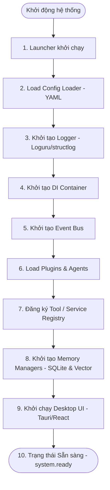

# Vòng đời Hệ thống Eric (System Lifecycle Specification)

Tài liệu này đặc tả quy trình khởi động (Bootstrapping), vận hành (Runtime) và tắt máy (Shutdown) của ứng dụng **Eric**.

---

## 1. Quy trình khởi động hệ thống (System Startup Sequence)

Khi người dùng bật máy tính hoặc khởi chạy Eric thủ công, hệ thống sẽ được nạp theo sơ đồ tuần tự bên dưới để đảm bảo mọi thành phần phụ thuộc đều được chuẩn bị sẵn sàng trước khi UI xuất hiện.

### Chi tiết các bước:
1. **Launcher**: Ứng dụng nền nhỏ (Windows Startup registry) phát hiện và khởi động tiến trình Core Python chạy ngầm.
2. **Load Config**: Bộ tải cấu hình đọc các tệp cấu hình `.yaml` trong thư mục `configs/`.
3. **Initialize Logger**: Thiết lập file log và định dạng ghi log thống nhất dựa trên cấu hình `logging.yaml`.
4. **Initialize DI Container**: Bộ chứa Dependency Injection được dựng để chuẩn bị cung cấp và quản lý vòng đời các Service.
5. **Initialize Event Bus**: Khởi tạo Event Bus nội bộ qua IPC/Socket để lắng nghe các thông điệp của hệ thống.
6. **Load Plugins & Agents**: Nạp động các plugin mở rộng và các agent thực thi từ thư mục `plugins/` và `tools/`.
7. **Register Services/Tools**: Các Agent tự động khai báo danh sách công cụ của mình lên `Service/Tool Registry`.
8. **Initialize Memory**: Thiết lập kết nối SQLite (Episodic/Semantic memory) và Vector DB (ChromaDB).
9. **Start Desktop UI**: Tauri kích hoạt và hiển thị giao diện React UI cho người dùng.
10. **System Ready**: Sự kiện `system.ready` được phát lên Event Bus để báo hiệu toàn hệ thống đã sẵn sàng làm việc.

---

## 2. Vận hành hệ thống (Runtime Lifecycle)

Trong suốt quá trình chạy, các trạng thái của hệ thống được kiểm soát chặt chẽ thông qua các Event của Event Bus. Mọi hành động tương tác của người dùng từ UI sẽ không kích hoạt trực tiếp hàm logic, mà thay vào đó sẽ gửi các sự kiện (Command/Event) để Core xử lý bất đồng bộ.

---

## 3. Quy trình tắt hệ thống (System Shutdown Sequence)

Khi người dùng chọn thoát ứng dụng Eric:
1. Phát sự kiện `system.shutdown` lên Event Bus.
2. **Ngắt tương tác UI**: Tauri UI ẩn cửa sổ và ngắt kết nối với Core.
3. **Dừng Scheduler**: Dừng các tác vụ chạy nền đang lập lịch để tránh ghi dở dữ liệu.
4. **Giải phóng Agents**: Gửi lệnh ngắt kết nối trình duyệt (Browser Agent) và các tiến trình terminal (Terminal Agent).
5. **Đóng kết nối Cơ sở dữ liệu**: Thực hiện flush bộ nhớ cache và lưu dữ liệu lưu trữ dở dang vào SQLite/Vector DB rồi đóng kết nối an toàn.
6. **Tắt tiến trình**: Giải phóng DI Container và dừng tiến trình Python Core hoàn toàn.
